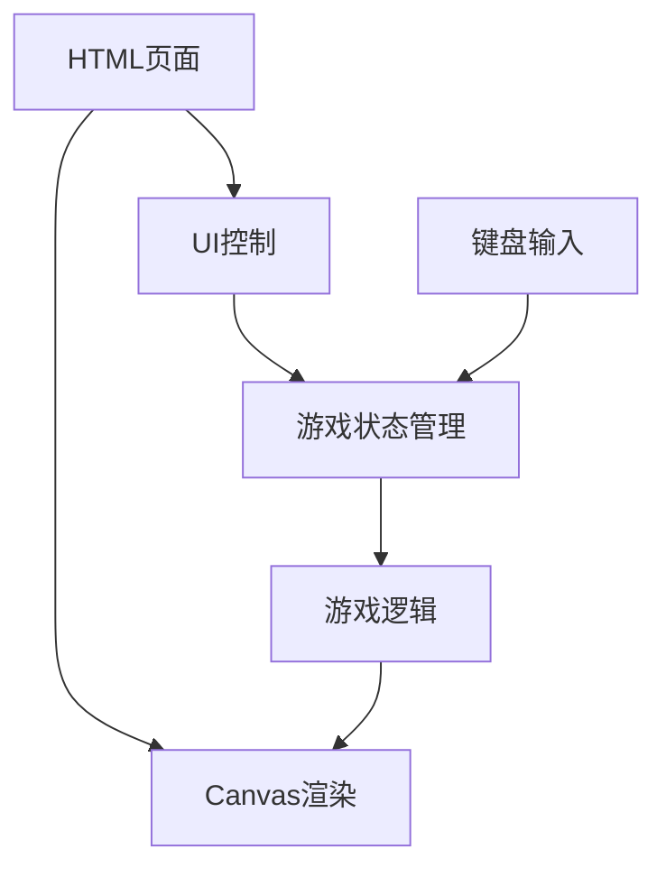

## 1. Architecture Design
本游戏采用纯前端实现，使用HTML5 Canvas进行渲染，JavaScript处理游戏逻辑。



## 2. Technology Description
- **前端框架**: 原生HTML5 + JavaScript + CSS3（为了简单高效，不使用复杂框架）
- **渲染引擎**: Canvas 2D API
- **构建工具**: 无特殊构建工具，直接运行
- **动画**: 使用requestAnimationFrame实现流畅动画
- **样式**: 复古像素风格CSS

## 3. 核心代码结构
```
/workspace/
├── index.html          # 主页面
├── css/
│   └── style.css       # 样式文件
└── js/
    ├── game.js         # 游戏主逻辑
    ├── mech.js         # 机甲类
    ├── renderer.js     # 渲染器
    └── input.js        # 输入处理
```

## 4. 数据模型

### 4.1 机甲角色数据
```javascript
class Mech {
  constructor(x, y, team, controls) {
    this.x = x;              // X坐标
    this.y = y;              // Y坐标
    this.team = team;        // 阵营（'blue' / 'red'）
    this.controls = controls;// 按键映射
    this.health = 100;       // 血量
    this.maxHealth = 100;    // 最大血量
    this.speed = 5;          // 移动速度
    this.width = 64;         // 宽度
    this.height = 64;        // 高度
    this.state = 'idle';     // 状态（idle/moving/attacking/defending）
    this.facing = team === 'blue' ? 1 : -1; // 朝向
    this.attackCooldown = 0; // 攻击冷却
    this.defendCooldown = 0; // 防御冷却
  }
}
```

### 4.2 游戏状态
```javascript
const GameState = {
  START: 'start',
  PLAYING: 'playing',
  PAUSED: 'paused',
  GAMEOVER: 'gameover'
};
```

## 5. 核心功能实现

### 5.1 游戏循环
```javascript
function gameLoop() {
  update();
  render();
  requestAnimationFrame(gameLoop);
}
```

### 5.2 输入处理
- 监听keydown和keyup事件
- 维护按键状态对象
- 映射到对应机甲操作

### 5.3 碰撞检测
```javascript
function checkCollision(mech1, mech2) {
  return mech1.x < mech2.x + mech2.width &&
         mech1.x + mech1.width > mech2.x &&
         mech1.y < mech2.y + mech2.height &&
         mech1.y + mech1.height > mech2.y;
}
```

### 5.4 攻击判定
```javascript
function checkAttack(attacker, defender) {
  if (attacker.state !== 'attacking') return false;
  const attackRange = 80;
  const distance = Math.abs(attacker.x - defender.x);
  return distance < attackRange && defender.state !== 'defending';
}
```

## 6. 渲染设计
- 使用Canvas绘制像素风格图形
- 实现简单的精灵动画系统
- 血量条等UI元素在Canvas外使用HTML/CSS渲染
