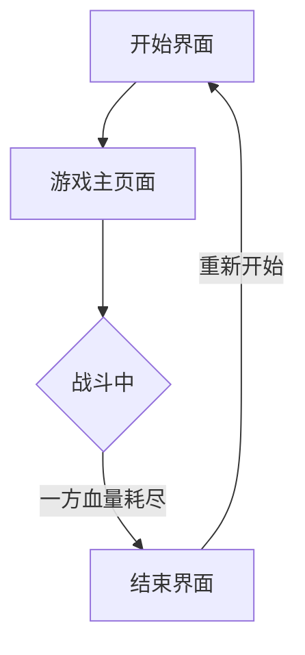

## 1. Product Overview
像素风机甲对战小游戏是一款双人对战游戏，玩家分别控制两个机甲角色，在复古像素风格的场景中进行战斗。游戏包含基本移动、攻击、防御等操作，以及血量与胜负机制，为玩家提供简单而有趣的对战体验。

## 2. Core Features

### 2.1 User Roles
| Role | Registration Method | Core Permissions |
|------|---------------------|------------------|
| Player 1 | 键盘控制 | 控制左侧机甲，使用WASD移动，空格键攻击，Shift防御 |
| Player 2 | 键盘控制 | 控制右侧机甲，使用方向键移动，Enter攻击，Ctrl防御 |

### 2.2 Feature Module
1. **游戏主页面**：游戏画布、角色信息面板、游戏控制
2. **开始界面**：游戏标题、操作说明、开始按钮
3. **结束界面**：胜负结果、重新开始按钮

### 2.3 Page Details
| Page Name | Module Name | Feature description |
|-----------|-------------|---------------------|
| 游戏主页面 | 游戏画布 | 渲染游戏场景、机甲角色、特效，处理游戏逻辑 |
| 游戏主页面 | 角色信息面板 | 显示双方机甲的血量条、状态信息 |
| 游戏主页面 | 游戏控制 | 开始/暂停游戏、重新开始 |
| 开始界面 | 标题与说明 | 显示游戏标题、操作说明、开始按钮 |
| 结束界面 | 胜负显示 | 显示获胜方、重新开始按钮 |

## 3. Core Process
游戏开始 → 玩家选择角色（默认双人）→ 双方控制机甲进行对战 → 使用移动、攻击、防御等操作 → 一方血量耗尽 → 游戏结束 → 显示胜负结果 → 可选择重新开始

## 4. User Interface Design
### 4.1 Design Style
- **设计风格**：复古像素风（8-bit/16-bit）
- **主色调**：深灰色背景、蓝色与红色为主色调（分别代表两个阵营）、黄色作为高亮色
- **字体**：使用像素风格的等宽字体
- **布局**：居中画布，两侧显示角色信息
- **按钮风格**：像素化按钮，带有边框和按下效果

### 4.2 Page Design Overview
| Page Name | Module Name | UI Elements |
|-----------|-------------|-------------|
| 游戏主页面 | 游戏画布 | 像素化场景、机甲角色动画、攻击/防御特效 |
| 游戏主页面 | 角色信息 | 像素风格血量条、角色名称、状态标签 |
| 开始界面 | 标题 | 大号像素字体标题、闪烁效果 |
| 开始界面 | 说明 | 操作说明卡片，使用表格展示按键对应功能 |

### 4.3 Responsiveness
- 桌面端为主，自适应不同屏幕尺寸
- 画布保持固定比例，居中显示

## 5. 素材方案
- **角色设计**：使用Canvas绘制像素风机甲，包含站立、移动、攻击、防御等动画帧
- **场景**：简单的像素风格地面和背景
- **特效**：攻击时的火花、防御时的护盾效果
- **音效**：可选添加简单的像素风格音效
